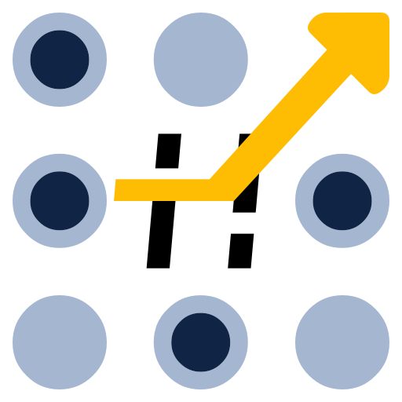
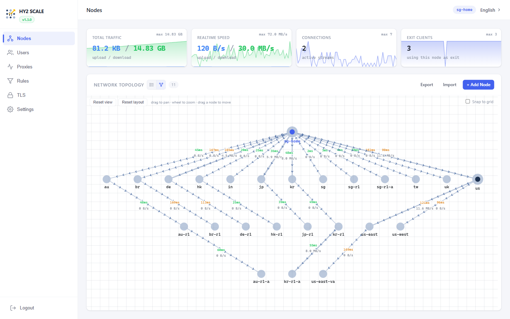
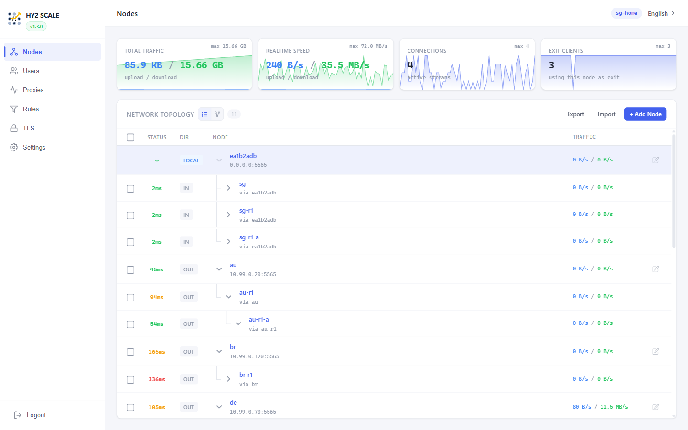

<p align="center">
  
</p>

<h1 align="center">HY2 SCALE</h1>

<p align="center">
  웹 관리 UI를 갖춘 Hysteria 2 메시 릴레이 네트워크.<br>
  어떤 노드를 통해서든 트래픽을 라우팅하고, VPN 서비스를 실행하며, 브라우저에서 모든 것을 관리하세요.
</p>

<p align="center">
  <a href="https://hub.docker.com/r/frankoong/hy2scale"></a>
  <a href="https://github.com/FrankoonG/hy2scale/wiki"></a>
  <br>
  <a href="README.md">English</a> | <a href="README-zh.md">中文</a> | <b>한국어</b>
</p>

---

전체 설치, 설정, API 문서는 **[Wiki](https://github.com/FrankoonG/hy2scale/wiki)**를 참고하세요.

## 빠른 시작

풀 모드 (호스트 네트워크 — 모든 기능 활성화):

```bash
docker run -d --name hy2scale \
  --network host --privileged \
  -v hy2scale-data:/data \
  --restart unless-stopped \
  frankoong/hy2scale:latest
```

브리지 모드 (VPN + 프록시, 라우팅 규칙 제외):

```bash
docker run -d --name hy2scale \
  --cap-add NET_ADMIN --cap-add NET_RAW \
  -p 5565:5565/tcp -p 5565:5565/udp \
  -p 500:500/udp -p 4500:4500/udp -p 1701:1701/udp -p 51820:51820/udp \
  -v hy2scale-data:/data \
  --restart unless-stopped \
  frankoong/hy2scale:latest
```

`http://<호스트>:5565/scale/` 접속 — 기본 로그인 `admin` / `admin`.

iKuai v4 사용자는 [Releases](https://github.com/FrankoonG/hy2scale/releases)에서 `.ipkg`를 다운로드해 앱 스토어로 설치하세요 — 자세한 내용은 [iKuai v4 가이드](https://github.com/FrankoonG/hy2scale/wiki/iKuai-v4-Installation)를 참고하세요.

## 주요 기능

- 노드를 메시로 연결하여 그중 어느 노드를 통해서든 트래픽을 라우팅합니다.
- 인터랙티브 그래프 또는 테이블 뷰에서 실시간 토폴로지와 지연 시간을 확인합니다.
- VPN / 프록시 서비스 실행: Hysteria 2, SOCKS5, HTTP, Shadowsocks, L2TP, IKEv2, WireGuard.
- 사용자별 출구 라우팅, 트래픽 제한, 만료일, 일괄 관리.
- IP 및 도메인 라우팅 규칙으로 특정 트래픽을 특정 출구로 보냅니다.
- 내장 CA 서명을 지원하는 TLS 인증서 관리.
- 다중 IP 피어 집계 (페일오버 또는 대역폭 결합).
- 백업 / 복원, 컨테이너 내 바이너리 업그레이드, EN / 中文 / 한국어 UI.

## 스크린샷

싱가포르 홈 노드가 여러 지역의 원격 노드와 피어링하는 토폴로지 그래프와 리스트 뷰:




## 빌드

```bash
git clone https://github.com/FrankoonG/hy2scale.git
cd hy2scale
docker build -t hy2scale .
```

## Star History

<a href="https://www.star-history.com/?repos=FrankoonG%2Fhy2scale&type=date&legend=top-left">
 <picture>
   <source media="(prefers-color-scheme: dark)" srcset="https://api.star-history.com/chart?repos=FrankoonG/hy2scale&type=date&theme=dark&legend=top-left" />
   <source media="(prefers-color-scheme: light)" srcset="https://api.star-history.com/chart?repos=FrankoonG/hy2scale&type=date&legend=top-left" />
   
 </picture>
</a>
