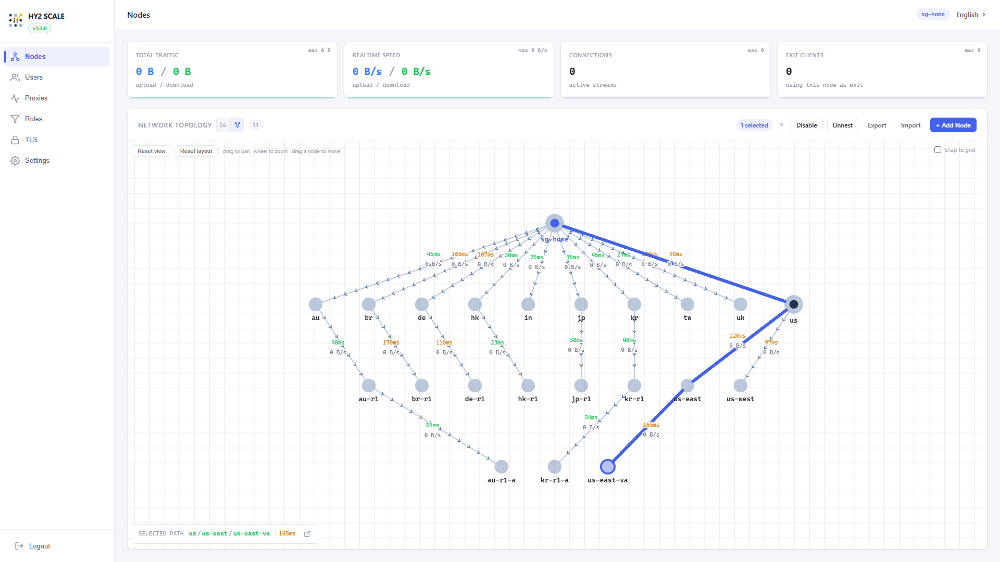
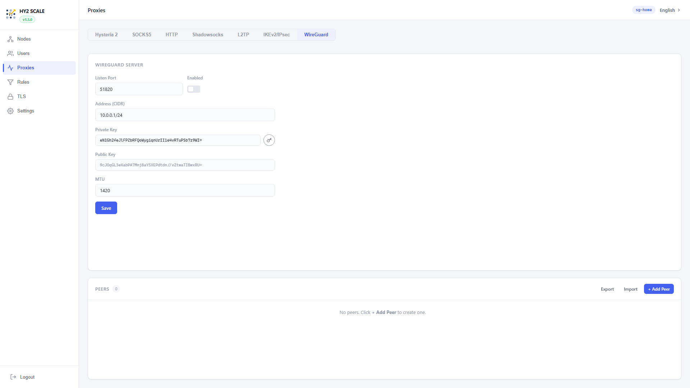

<p align="center">
  
</p>

<h1 align="center">HY2 SCALE</h1>

<p align="center">
  웹 관리 UI를 갖춘 Hysteria 2 메시 릴레이 네트워크.<br>
  어떤 노드를 통해서든 트래픽을 라우팅하고, VPN 서비스를 실행하며, 브라우저에서 모든 것을 관리하세요.
</p>

<p align="center">
  <a href="https://hub.docker.com/r/frankoong/hy2scale"></a>
  <a href="https://github.com/FrankoonG/hy2scale/wiki"></a>
  <a href="LICENSE"></a>
  <br>
  <a href="README.md">English</a> | <a href="README-zh.md">中文</a> | <b>한국어</b>
</p>

---

## 문서

**[Wiki](https://github.com/FrankoonG/hy2scale/wiki)** — 설치, 설정, 프로토콜별 가이드, API 레퍼런스.

## 빠른 시작

### 풀 모드 (호스트 네트워크 — 라우팅 규칙을 포함한 모든 기능)

```bash
docker run -d --name hy2scale \
  --network host --privileged \
  -v hy2scale-data:/data \
  --restart unless-stopped \
  frankoong/hy2scale:latest
```

### 브리지 모드 (L2TP / IKEv2 / WireGuard, 라우팅 규칙 제외)

```bash
docker run -d --name hy2scale \
  --cap-add NET_ADMIN --cap-add NET_RAW \
  -p 5565:5565/tcp -p 5565:5565/udp \
  -p 500:500/udp -p 4500:4500/udp -p 1701:1701/udp -p 51820:51820/udp \
  -v hy2scale-data:/data \
  --restart unless-stopped \
  frankoong/hy2scale:latest
```

### iKuai v4

[Releases](https://github.com/FrankoonG/hy2scale/releases)에서 `.ipkg` 파일을 다운로드한 뒤 **고급 앱 → 앱 마켓 → 로컬 설치**로 설치하세요. 자세한 내용은 [iKuai v4 가이드](https://github.com/FrankoonG/hy2scale/wiki/iKuai-v4-Installation)를 참고하세요.

---

`http://<호스트>:5565/scale/` 접속 — 기본 로그인: `admin` / `admin`.

## 주요 기능

- **메시 네트워크** — Hysteria 2 QUIC 터널 위의 분산형 P2P 토폴로지. 각 노드는 서버이자 클라이언트 역할을 동시에 수행합니다.
- **중첩 검색** — 기존 터널을 통해 피어의 피어에 도달하며, 임의의 깊이까지 확장 가능합니다. iron-rule 기반 경로 필터링으로 순환 및 무단 출구를 방지합니다.
- **그래프 토폴로지 뷰** — 팬 / 줌 / 핀치 줌이 가능한 인터랙티브 SVG 그래프. 모든 엣지에 실시간 지연 시간과 처리량이 표시되며, 레이아웃은 서버에 영속 저장되고 SSE를 통해 브라우저 세션 간에 동기화됩니다.
- **출구 라우팅** — 사용자별 / 규칙별로 임의의 노드 또는 멀티홉 체인 (`jp`, `us/us-east/us-east-va` 등)을 통해 트래픽을 라우팅합니다.
- **VPN 프로토콜** — Hysteria 2, SOCKS5, HTTP, Shadowsocks, L2TP/IPsec, IKEv2/IPsec, WireGuard. 모두 동일한 사용자 데이터베이스로 인증하며 사용자별 출구 라우팅을 따릅니다.
- **라우팅 규칙** — iptables DNAT + 투명 프록시 (호스트 모드) 또는 TUN 모드 (브리지 / 라우터 펌웨어)를 통한 IP 및 도메인 기반 트래픽 라우팅.
- **TLS & CA** — UI에서 인증서 생성, 가져오기, CA 서명이 가능합니다. 업로드한 CA로부터 IKEv2 서버 인증서를 자동 발급합니다.
- **Bond 집계** — 다중 주소 피어 지원: 같은 원격지로 향하는 여러 링크의 대역폭을 집계하거나 페일오버(quality) 모드로 실행합니다.
- **경량 Linux / 라우터 호환** — 경량화된 Linux 시스템 (iKuai v4 커스텀 커널, 스톡 OpenWrt 등)에서도 `--privileged` 없이 비호스트 Docker로 실행됩니다. 자동 호환 모드가 손상된 커널 경로를 xfrm-bridge와 TUN 캡처로 대체합니다.
- **[iKuai v4 지원](https://github.com/FrankoonG/hy2scale/wiki/iKuai-v4-Installation)** — 호환 모드가 자동 활성화된 원클릭 `.ipkg` 설치.
- **웹 UI** — English / 中文 / 한국어를 지원하는 React SPA. Dark Reader 확장 친화적이며 모바일 폭까지 반응형이고, 새 서버 빌드가 배포되면 자동으로 새로 고침됩니다.
- **핫 리로드** — L2TP, IKEv2, WireGuard, Shadowsocks, SOCKS5, HTTP, 프록시 모두 컨테이너 재시작 없이 리로드됩니다.
- **컨테이너 내 업그레이드** — 웹 UI에서 새 바이너리 타르볼을 업로드하여 현장 업그레이드할 수 있습니다. 컨테이너 재빌드가 필요 없습니다.

## 스크린샷

다단계 중첩이 적용된 네트워크 토폴로지 (싱가포르 기반 홈 노드가 8개국과 피어링 중이며, 일부 국가는 서브 피어를 노출합니다):


목적지를 선택하면 전체 릴레이 경로 (`sg-home → us → us-east → us-east-va`, 누적 165 ms)와 홉별 작업이 표시됩니다:



모든 VPN 프로토콜에서 자격 증명을 공유하며 사용자별 출구 라우팅이 적용되는 사용자 목록:


한 곳에 모인 7가지 프록시 프로토콜:



## 아키텍처

```
                               sg-home (self)
     /    /      |      |      |      |      |      |      \      \
    jp  us   kr  hk   tw   in   de   uk    au    br
    |   / \    \                     |            |     |
   jp-r1 us-east us-west           de-r1        au-r1   br-r1
          |                                      |
      us-east-va                              au-r1-a
```

모든 노드는 Hysteria 2 QUIC 서버와 릴레이 플레인을 실행합니다. 한 노드는 순수 릴레이, 순수 출구, 또는 두 역할을 동시에 수행할 수 있습니다. NAT 뒤의 장치도 부모 피어가 QUIC 터널을 유지하기 때문에 도달 가능합니다.

## 빌드

```bash
git clone https://github.com/FrankoonG/hy2scale.git
cd hy2scale
docker build -t hy2scale .
```

프런트엔드만:

```bash
cd web/ui-framework && npm ci && npm run build
cd ../app        && npm ci && npm run build
```

## 라이선스

GPL-3.0-or-later — [LICENSE](LICENSE)를 참고하세요. Docker 이미지는 strongSwan (GPLv2+), iptables (GPLv2+), xl2tpd (GPLv2+)를 번들하고 있으므로 재배포 시 라이선스 전문과 소스 코드 제공 안내를 포함해야 합니다.

## Star History

<a href="https://www.star-history.com/?repos=FrankoonG%2Fhy2scale&type=date&legend=top-left">
 <picture>
   <source media="(prefers-color-scheme: dark)" srcset="https://api.star-history.com/chart?repos=FrankoonG/hy2scale&type=date&theme=dark&legend=top-left" />
   <source media="(prefers-color-scheme: light)" srcset="https://api.star-history.com/chart?repos=FrankoonG/hy2scale&type=date&legend=top-left" />
   
 </picture>
</a>
