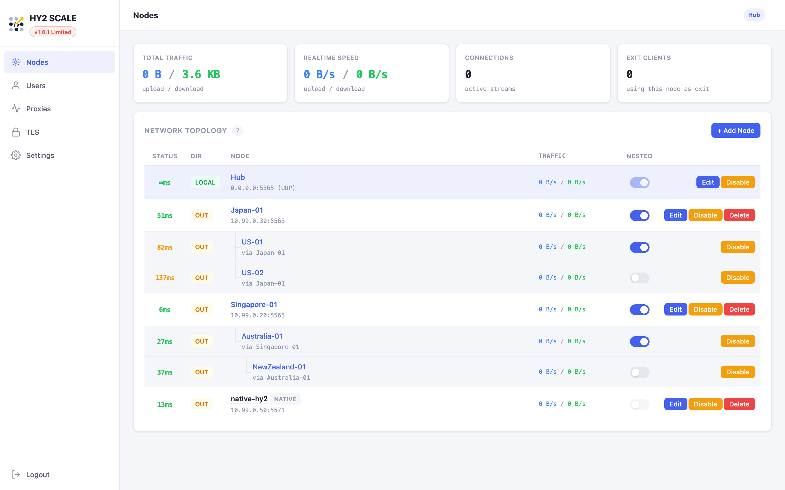
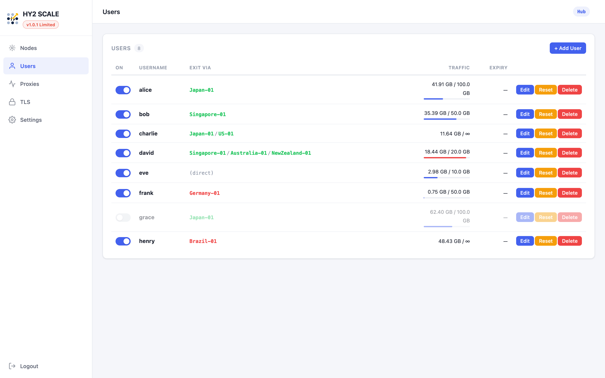

<p align="center">
  
</p>

<h1 align="center">HY2 SCALE</h1>

<p align="center">
  A mesh relay network built on <a href="https://github.com/apernet/hysteria">Hysteria 2</a> QUIC tunnels, with a web management UI for multi-node orchestration, user management, and VPN services.
</p>

---

## Features

- **Mesh Topology** — Connect nodes in a peer-to-peer mesh with automatic discovery, nested peers, and multi-level nesting. Native Hysteria 2 servers are detected and integrated seamlessly.

- **Per-User Exit Routing** — Each user can be assigned a different exit path through the mesh. Traffic is transparently routed through relay chains (e.g., `Japan-01/US-01`) with per-user traffic accounting.

- **VPN Protocols** — Built-in SOCKS5, Shadowsocks, L2TP/IPsec, and IKEv2/IPsec servers. L2TP and IKEv2 support per-user exit routing via transparent proxy.

- **Real-Time Monitoring** — Live latency probing, per-peer traffic rates, connection status, and nested topology visualization in a single-page web UI.

- **TLS Management** — Generate self-signed certificates, import from PEM or file path, with full lifecycle management.

- **Docker-Only Deployment** — No config files needed. All state persists to a `/data` volume. Single binary, single container.

## Screenshots

### Nodes

Multi-level mesh topology with real-time latency, nested peer discovery, and native Hysteria 2 compatibility.



### Users

Per-user exit routing with traffic limits, usage tracking, and reachability indicators. Green hops are reachable through the mesh; red hops indicate unreachable or non-existent nodes.



## Quick Start

```bash
docker run -d --name hy2scale \
  --network host \
  --cap-add NET_ADMIN \
  --device-cgroup-rule='c 108:0 rwm' \
  -v hy2scale-data:/data \
  hy2scale:latest
```

Open `http://<host>:5565/scale/` — default login: `admin` / `admin`

> **Note:** `--network host` is required for L2TP/IPsec and IKEv2 VPN services. Without it, these features are disabled (shown as "Limited" in the UI). SOCKS5, Shadowsocks, and the mesh relay work with standard port mapping.

### Minimal (relay only, no VPN)

```bash
docker run -d --name hy2scale \
  -p 5565:5565/tcp -p 5565:5565/udp \
  -v hy2scale-data:/data \
  hy2scale:latest
```

## Architecture

```
                    ┌──────────┐
                    │   Hub    │
                    └────┬─────┘
               ┌─────────┼──────────┐
          ┌────┴───┐ ┌───┴────┐ ┌───┴────────┐
          │Japan-01│ │  SG-01 │ │ native-hy2 │
          └───┬────┘ └───┬────┘ └────────────┘
           ┌──┴──┐    ┌──┴──┐       [NATIVE]
          US-01 US-02 AU-01
                       │
                      NZ-01
```

Each node runs a Hysteria 2 server and connects to peers via QUIC tunnels. The relay protocol handles:

- **Peer discovery** — Nodes exchange peer lists, enabling multi-level nested topology
- **Latency probing** — Background ping with cross-node latency reporting
- **Traffic routing** — `DialTCP` for direct peers, `DialVia` for multi-hop chains
- **Native hy2 compat** — Auto-detect plain Hysteria 2 servers (no relay protocol)

## VPN Services

| Protocol | Auth | Exit Routing | Notes |
|----------|------|--------------|-------|
| SOCKS5 | Username/Password | Per-user exit_via | RFC 1929 auth |
| Shadowsocks | Per-user key | Per-user exit_via | AEAD ciphers |
| L2TP/IPsec | MSCHAPv2 | Per-user exit_via | iOS/macOS/Windows/Android native client |
| IKEv2/IPsec | EAP-MSCHAPv2 or PSK | Per-user or global exit | iOS/macOS/Windows/Android native client |

### L2TP/IPsec & IKEv2/IPsec

These protocols use the operating system's **built-in VPN client** — no third-party app required. Users connect directly from iOS Settings, macOS System Preferences, Windows VPN settings, or Android VPN settings.

- **L2TP** uses IKEv1 + xl2tpd + PPP (MSCHAPv2 auth). Compatible with virtually every OS.
- **IKEv2** uses certificate-based authentication with EAP-MSCHAPv2 for user credentials. Supports both certificate mode (import your own CA) and PSK mode.

Both protocols require `--network host` and `--cap-add NET_ADMIN`:

```bash
docker run -d --name hy2scale \
  --network host \
  --cap-add NET_ADMIN \
  --device-cgroup-rule='c 108:0 rwm' \
  -v hy2scale-data:/data \
  hy2scale:latest
```

> Without `--network host`, the web UI shows **"v1.x.x Limited"** and L2TP/IKEv2 panels are disabled. This is because IPsec requires direct access to the host network stack — Docker port mapping cannot handle ESP tunnel/transport mode packets. All other features (mesh relay, SOCKS5, Shadowsocks, web UI) work normally with standard port mapping.

## Configuration

All configuration is managed through the web UI. No config files to edit. State is persisted to the `/data` volume:

```
/data/
├── node-id          # Unique node identifier (editable)
├── config.yaml      # Auto-generated, atomic writes
└── tls/             # Certificates (PEM)
    ├── default.crt
    ├── default.key
    └── default.name
```

## Building

```bash
docker build -t hy2scale .
```

The image includes:
- Go binary (statically compiled)
- strongSwan 5.8.4 (compiled from source, IKEv1 + IKEv2)
- xl2tpd, pppd, iptables-legacy
- ~73MB total

## License

MIT
